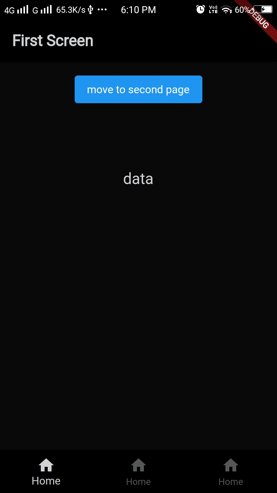

# widely used flutter widgets and functions.

##### Key points :
  - This package allows developers to fetch data from the server with the easiest way,
  - FcNavigator navigator that makes the navigation process much easier.
  - Remove Glow Behavior from a list view.
  - Pre-Build responsive text style
  - Horizontal and vertical dimensions SizedBox alternative
  - Double press exit function
  - Dark Mode 

## How to Use 

To use flutter_const, the first starts by importing the package.
```dart
import 'package:flutter_const/flutter_const.dart';
```

### ListView No Glow
 
```dart
class Demo extends StatelessWidget {
  const Demo({Key? key}) : super(key: key);

  @override
  Widget build(BuildContext context) {
    return Container(
      child: ScrollConfiguration(
        behavior: FcNoGlowBehavior(),
        child: ListView(),
      ),
    );
  }
}
```

### Api Call
```dart
Future<Album> fetchAlbum() async {
  ApiBaseHelper _helper = ApiBaseHelper();
  final response = await _helper.get(baseurl: 'jsonplaceholder.typicode.com', url: 'albums/2');
  return Album.fromJson(response);
}
```

### Dark Mode
```dart
class MyApp extends StatelessWidget {
  @override
  Widget build(BuildContext context) {
    return MaterialApp(
      title: 'Flutter Demo',
      theme: FcTheme.light,
      darkTheme: FcTheme.dark,
      themeMode: ThemeMode.system,
      home: MyHomePage(),
    );
  }
}
```



### Text Style
```dart 
FcTextStyle textStyle = FcTextStyle();
ElevatedButton(
    onPressed: () {},
    child: Text(
        'move to second page',
        style: textStyle.buttonText(context),
        ),
    )
```

### Text Format
```dart 
Text(
    "data join".capitalizeFirstOfEach,
    style: textStyle.h6Text(context),
    )
```

### Dimensions
```dart 
// Vertical
fcVSizedBox 
fcVSizedBox1
fcVSizedBox2
fcVSizedBox3
fcVSizedBox4
fcVSizedBox5
fcVSizedBox6

// Horizantel
fcHSizedBox 
fcHSizedBox1
fcHSizedBox2
fcHSizedBox3
fcHSizedBox4
fcHSizedBox5
fcHSizedBox6
```
The base sized is 5 and the rest of the double the previous one

### Navigations
```dart 
FcNavigator().push(context, screen: SecondPage());
```